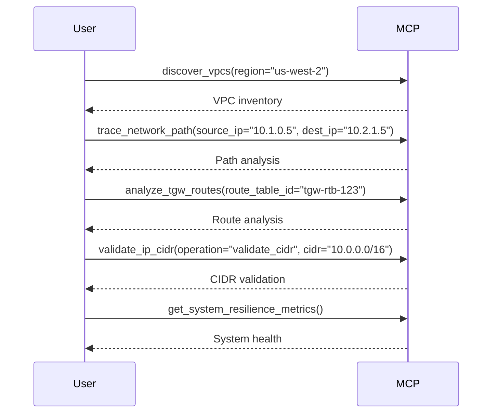

# CloudWAN MCP Tool Documentation

This document provides comprehensive documentation for all 29+ networking tools available in the CloudWAN MCP Server.

## 🔍 Simple Discovery Tools

### Tool: SimpleDiscoverIpDetails
**Category:** Simple Discovery
**Description:** Simple IP discovery with strict validation
**Use Cases:**
- Verify if an IP is IPv4/IPv6
- Check if address is private/global/multicast

**Parameters:**
| Name | Type | Required | Description |
|------|------|----------|-------------|
| ip_address | string | Yes | IP address to analyze (7-45 chars) |
| region | string | No | AWS region (pattern: ^[a-z]{2,3}-[a-z]+-\d+$) |

**Example:**
```json
{
  "tool": "SimpleDiscoverIpDetails",
  "args": {
    "ip_address": "192.168.1.1",
    "region": "us-west-2"
  }
}
```

---

### Tool: SimpleListCoreNetworks
**Category:** Simple Discovery
**Description:** Simple core network listing with validation
**Use Cases:** Quick inventory of core networks

**Parameters:**
| Name | Type | Required | Description |
|------|------|----------|-------------|
| region | string | No | AWS region (pattern: ^[a-z]{2,3}-[a-z]+-\d+$) |

**Example:**
```json
{
  "tool": "SimpleListCoreNetworks",
  "args": {"region": "us-east-1"}
}
```

---

## 🌐 Advanced Discovery Tools

### Tool: trace_network_path
**Category:** Advanced Discovery
**Description:** Trace network paths between IPs
**Use Cases:** Connectivity troubleshooting, route analysis

**Parameters:**
| Name | Type | Required | Description |
|------|------|----------|-------------|
| source_ip | string | Yes | Source IP address |
| destination_ip | string | Yes | Destination IP address |
| region | string | No | AWS region |

**Example:**
```json
{
  "tool": "trace_network_path",
  "args": {
    "source_ip": "10.0.0.1",
    "destination_ip": "10.0.5.10",
    "region": "us-east-1"
  }
}
```

---

### Tool: list_core_networks
**Category:** Advanced Discovery
**Description:** List CloudWAN core networks

**Parameters:**
| Name | Type | Required | Description |
|------|------|----------|-------------|
| region | string | No | AWS region |

---

### Tool: get_global_networks
**Category:** Advanced Discovery
**Description:** Discover global networks

**Parameters:**
| Name | Type | Required | Description |
|------|------|----------|-------------|
| region | string | No | AWS region |

---

### Tool: discover_vpcs
**Category:** Advanced Discovery
**Description:** Discover VPCs in specified region

**Parameters:**
| Name | Type | Required | Description |
|------|------|----------|-------------|
| region | string | No | AWS region |

---

### Tool: discover_ip_details
**Category:** Advanced Discovery
**Description:** Advanced IP details discovery

**Parameters:**
| Name | Type | Required | Description |
|------|------|----------|-------------|
| ip_address | string | Yes | IP address to analyze |
| region | string | No | AWS region |

---

### Tool: validate_ip_cidr
**Category:** Advanced Discovery
**Description:** Comprehensive IP/CIDR validation and networking utilities

**Parameters:**
| Name | Type | Required | Description |
|------|------|----------|-------------|
| operation | string | Yes | "validate_ip" or "validate_cidr" |
| ip | string | No | IP address to validate (if operation=validate_ip) |
| cidr | string | No | CIDR to validate (if operation=validate_cidr) |

---

## 🔧 Network Function Group Tools

### Tool: list_network_function_groups
**Category:** Network Function Groups
**Description:** List and discover Network Function Groups

**Parameters:**
| Name | Type | Required | Description |
|------|------|----------|-------------|
| region | string | No | AWS region |

---

### Tool: analyze_network_function_group
**Category:** Network Function Groups
**Description:** Analyze Network Function Group details and policies

**Parameters:**
| Name | Type | Required | Description |
|------|------|----------|-------------|
| group_name | string | Yes | Network Function Group name |
| region | string | No | AWS region |

---

## 🌐 CloudWAN Policy Tools

### Tool: validate_cloudwan_policy
**Category:** CloudWAN Policy
**Description:** Validate CloudWAN policy configurations

**Parameters:**
| Name | Type | Required | Description |
|------|------|----------|-------------|
| policy_document | dict | Yes | CloudWAN policy document |

---

### Tool: get_core_network_policy
**Category:** CloudWAN Policy
**Description:** Retrieve the policy document for a CloudWAN Core Network

**Parameters:**
| Name | Type | Required | Description |
|------|------|----------|-------------|
| core_network_id | string | Yes | Core Network ID |
| alias | string | No | Policy alias (default: "LIVE") |

---

### Tool: get_core_network_change_set
**Category:** CloudWAN Policy
**Description:** Retrieve policy change sets for a CloudWAN Core Network

**Parameters:**
| Name | Type | Required | Description |
|------|------|----------|-------------|
| core_network_id | string | Yes | Core Network ID |
| policy_version_id | string | Yes | Policy Version ID |

---

### Tool: get_core_network_change_events
**Category:** CloudWAN Policy
**Description:** Retrieve change events for a CloudWAN Core Network

**Parameters:**
| Name | Type | Required | Description |
|------|------|----------|-------------|
| core_network_id | string | Yes | Core Network ID |
| policy_version_id | string | Yes | Policy Version ID |

---

### Tool: analyze_segment_routes
**Category:** CloudWAN Policy
**Description:** CloudWAN segment routing analysis and optimization

**Parameters:**
| Name | Type | Required | Description |
|------|------|----------|-------------|
| core_network_id | string | Yes | Core Network ID |
| segment_name | string | Yes | Segment name to analyze |
| region | string | No | AWS region |

---

## 🚉 Transit Gateway Tools

### Tool: manage_tgw_routes
**Category:** Transit Gateway
**Description:** Manage Transit Gateway routes - list, create, delete, blackhole

**Parameters:**
| Name | Type | Required | Description |
|------|------|----------|-------------|
| operation | string | Yes | Route operation (create/delete/blackhole/list) |
| route_table_id | string | Yes | Transit Gateway Route Table ID |
| destination_cidr | string | Yes | Destination CIDR block |
| region | string | No | AWS region |

---

### Tool: analyze_tgw_routes
**Category:** Transit Gateway
**Description:** Comprehensive Transit Gateway route analysis

**Parameters:**
| Name | Type | Required | Description |
|------|------|----------|-------------|
| route_table_id | string | Yes | Transit Gateway Route Table ID |
| region | string | No | AWS region |

---

### Tool: analyze_tgw_peers
**Category:** Transit Gateway
**Description:** Transit Gateway peering analysis and troubleshooting

**Parameters:**
| Name | Type | Required | Description |
|------|------|----------|-------------|
| peer_id | string | Yes | Transit Gateway attachment ID |
| region | string | No | AWS region |

---

## 🛠️ Configuration Management

### Tool: aws_config_manager
**Category:** Configuration
**Description:** Manage AWS configuration settings dynamically

**Parameters:**
| Name | Type | Required | Description |
|------|------|----------|-------------|
| operation | string | Yes | get, set, list, reset, get_profile, get_region, list_profiles, check_credentials |
| profile | string | No | AWS profile name |
| region | string | No | AWS region |

---

## 🛡️ Network Firewall Tools

### Tool: monitor_anfw_logs
**Category:** Network Firewall
**Description:** Monitor AWS Network Firewall logs

**Parameters:**
| Name | Type | Required | Description |
|------|------|----------|-------------|
| firewall_name | string | Yes | Network Firewall name |
| region | string | No | AWS region |

---

### Tool: analyze_anfw_policy
**Category:** Network Firewall
**Description:** Analyze AWS Network Firewall policy

**Parameters:**
| Name | Type | Required | Description |
|------|------|----------|-------------|
| policy_arn | string | Yes | Network Firewall policy ARN |
| region | string | No | AWS region |

---

### Tool: analyze_five_tuple_flow
**Category:** Network Firewall
**Description:** Analyze network five-tuple flow

**Parameters:**
| Name | Type | Required | Description |
|------|------|----------|-------------|
| source_ip | string | Yes | Source IP address |
| dest_ip | string | Yes | Destination IP address |
| source_port | int | Yes | Source port (1-65535) |
| dest_port | int | Yes | Destination port (1-65535) |
| protocol | string | Yes | Protocol (TCP/UDP/ICMP) |

---

### Tool: parse_suricata_rules
**Category:** Network Firewall
**Description:** Parse Suricata rules for Network Firewall

**Parameters:**
| Name | Type | Required | Description |
|------|------|----------|-------------|
| rules_content | string | Yes | Suricata rules content |

---

### Tool: simulate_policy_changes
**Category:** Network Firewall
**Description:** Simulate Network Firewall policy changes

**Parameters:**
| Name | Type | Required | Description |
|------|------|----------|-------------|
| policy_content | string | Yes | Policy configuration content |
| test_scenarios | string | Yes | Test scenario definitions |

---

## 🔄 Circuit Breaker & Resilience Tools

### Tool: get_circuit_breaker_status
**Category:** Circuit Breaker
**Description:** Get status of all circuit breakers in the system

**Parameters:** None

**Example:**
```json
{
  "tool": "get_circuit_breaker_status",
  "args": {}
}
```

---

### Tool: get_system_resilience_metrics
**Category:** Circuit Breaker
**Description:** Get comprehensive resilience metrics for the system

**Parameters:** None

---

## 🏗️ Infrastructure as Code Tools

### Tool: analyze_iac_firewall_policy
**Category:** Infrastructure as Code
**Description:** Analyze IaC firewall policy

**Parameters:**
| Name | Type | Required | Description |
|------|------|----------|-------------|
| content | string | Yes | IaC policy content |
| format_hint | string | No | Format hint (terraform/cloudformation/cdk) |

---

### Tool: simulate_iac_firewall_traffic
**Category:** Infrastructure as Code
**Description:** Simulate IaC firewall traffic

**Parameters:**
| Name | Type | Required | Description |
|------|------|----------|-------------|
| content | string | Yes | IaC firewall configuration |
| test_flows | string | Yes | Traffic test scenarios |
| format_hint | string | No | Policy format hint |

---

### Tool: validate_iac_firewall_syntax
**Category:** Infrastructure as Code
**Description:** Validate IaC firewall policy syntax

**Parameters:**
| Name | Type | Required | Description |
|------|------|----------|-------------|
| content | string | Yes | IaC policy content |
| format_hint | string | No | Policy format hint |

---

## 🔄 Advanced Workflows & Tool Chaining

### Complete Network Troubleshooting Workflow



**Workflow Steps:**
1. **Environment Discovery**: Start with `discover_vpcs` to map network topology
2. **Path Analysis**: Use `trace_network_path` to understand connectivity
3. **Route Validation**: Apply `analyze_tgw_routes` for route table analysis
4. **CIDR Verification**: Run `validate_ip_cidr` to confirm addressing
5. **Health Check**: Monitor with `get_system_resilience_metrics`

---

## 📋 Tool Categories Summary

| Category | Tools | Count |
|----------|-------|--------|
| Simple Discovery | SimpleDiscoverIpDetails, SimpleListCoreNetworks | 2 |
| Advanced Discovery | trace_network_path, list_core_networks, get_global_networks, discover_vpcs, discover_ip_details, validate_ip_cidr | 6 |
| Network Function Groups | list_network_function_groups, analyze_network_function_group | 2 |
| CloudWAN Policy | validate_cloudwan_policy, get_core_network_policy, get_core_network_change_set, get_core_network_change_events, analyze_segment_routes | 5 |
| Transit Gateway | manage_tgw_routes, analyze_tgw_routes, analyze_tgw_peers | 3 |
| Configuration | aws_config_manager | 1 |
| Network Firewall | monitor_anfw_logs, analyze_anfw_policy, analyze_five_tuple_flow, parse_suricata_rules, simulate_policy_changes | 5 |
| Circuit Breaker | get_circuit_breaker_status, get_system_resilience_metrics | 2 |
| Infrastructure as Code | analyze_iac_firewall_policy, simulate_iac_firewall_traffic, validate_iac_firewall_syntax | 3 |

**Total: 29 Tools**
