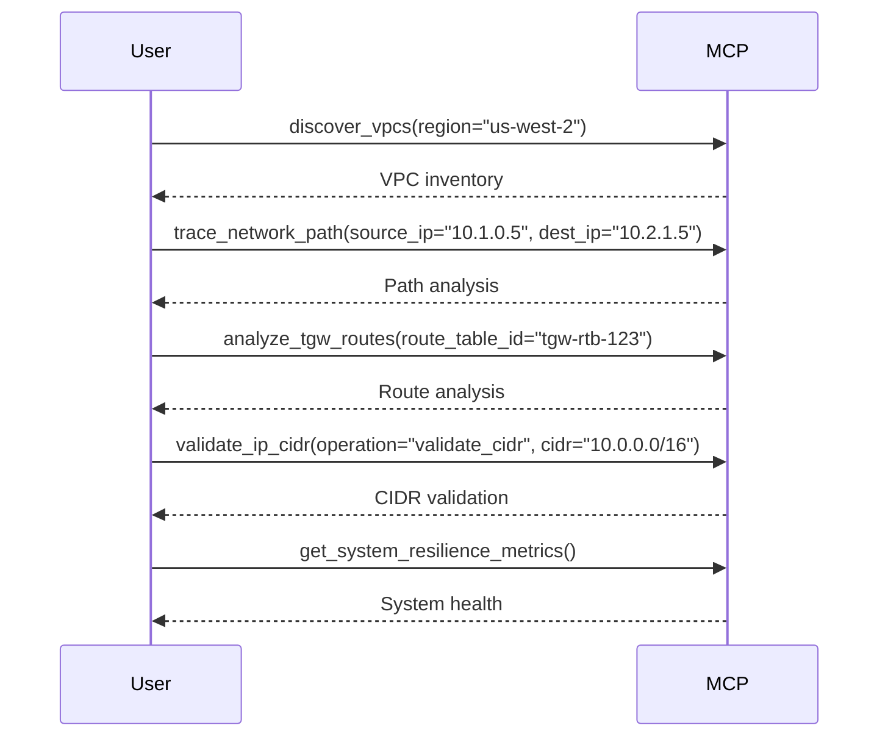

# CloudWAN MCP Tool Documentation

This document provides comprehensive documentation for all 29+ networking tools available in the CloudWAN MCP Server.

## 🔍 Simple Discovery Tools


## 🌐 Advanced Discovery Tools

### Tool: trace_network_path
**Category:** Network Discovery
**Description:** Trace network connectivity between IP addresses using AWS Reachability Analyzer
**AWS Services:** EC2 Reachability Analyzer, VPC Flow Logs, Transit Gateway Network Manager

**Parameters:**
| Name | Type | Required | Description |
|------|------|----------|-------------|
| source_ip | string | Yes | Source IP address (IPv4 or IPv6) |
| destination_ip | string | Yes | Destination IP address (IPv4 or IPv6) |
| region | string | No | AWS region (defaults to configured region) |
| protocol | string | No | Protocol to analyze (TCP/UDP/ICMP) |
| port | integer | No | Destination port (for TCP/UDP) |

**Real Usage Example:**
```json
{
  "tool": "trace_network_path",
  "args": {
    "source_ip": "10.0.1.100",
    "destination_ip": "10.1.2.50",
    "region": "us-west-2",
    "protocol": "TCP",
    "port": 443
  }
}
```

**Expected Response Structure:**
```json
{
  "success": true,
  "source_ip": "10.0.1.100",
  "destination_ip": "10.1.2.50",
  "region": "us-west-2",
  "reachability_status": "REACHABLE",
  "path_analysis": {
    "hops": [
      {
        "hop_number": 1,
        "component_type": "EC2_INSTANCE",
        "component_id": "i-1234567890abcdef0",
        "component_arn": "arn:aws:ec2:us-west-2:123456789012:instance/i-1234567890abcdef0"
      },
      {
        "hop_number": 2,
        "component_type": "TRANSIT_GATEWAY",
        "component_id": "tgw-0123456789abcdef0",
        "component_arn": "arn:aws:ec2:us-west-2:123456789012:transit-gateway/tgw-0123456789abcdef0"
      }
    ],
    "analysis_id": "ari-0123456789abcdef0",
    "analysis_status": "succeeded"
  }
}
```

**Error Handling:**
- `InvalidIPAddress`: IP address format validation failed
- `ReachabilityAnalysisException`: AWS Reachability Analyzer service error
- `InsufficientPermissions`: Missing ec2:CreateNetworkInsightsPath permission

---

### Tool: list_core_networks
**Category:** Core Network Management
**Description:** List CloudWAN Core Networks with comprehensive metadata
**AWS Services:** Network Manager

**Parameters:**
| Name | Type | Required | Description |
|------|------|----------|-------------|
| region | string | No | AWS region (global service, but region affects response) |
| max_results | integer | No | Maximum results to return (1-100) |
| next_token | string | No | Pagination token for large result sets |

**Real AWS API Integration:**
```python
# Actual implementation uses:
response = networkmanager_client.list_core_networks(
    MaxResults=max_results,
    NextToken=next_token if next_token else None
)
```

**Expected Response Structure:**
```json
{
  "success": true,
  "region": "us-west-2",
  "core_networks": [
    {
      "CoreNetworkId": "core-network-0123456789abcdef0",
      "CoreNetworkArn": "arn:aws:networkmanager::123456789012:core-network/core-network-0123456789abcdef0",
      "GlobalNetworkId": "global-network-0123456789abcdef0", # pragma: allowlist secret
      "State": "AVAILABLE",
      "Description": "Production CloudWAN Core Network",
      "CreatedAt": "2024-01-15T10:30:00.000Z",
      "Tags": [
        {
          "Key": "Environment",
          "Value": "Production"
        }
      ]
    }
  ],
  "total_count": 1,
  "next_token": null
}
```

### Tool: get_global_networks
**Category:** Advanced Discovery
**Description:** Discover global networks

**Parameters:**
| Name | Type | Required | Description |
|------|------|----------|-------------|
| region | string | No | AWS region |

---

### Tool: discover_vpcs
**Category:** Advanced Discovery
**Description:** Discover VPCs in specified region

**Parameters:**
| Name | Type | Required | Description |
|------|------|----------|-------------|
| region | string | No | AWS region |

---

### Tool: discover_ip_details
**Category:** Network Discovery
**Description:** Comprehensive IP address analysis with AWS networking context
**AWS Services:** EC2, Route Tables, Security Groups, Network Interfaces

**Parameters:**
| Name | Type | Required | Description |
|------|------|----------|-------------|
| ip_address | string | Yes | IP address to analyze |
| region | string | No | AWS region for analysis |
| include_security_groups | boolean | No | Include security group rules analysis |
| include_routing | boolean | No | Include route table analysis |

**Real Usage Example:**
```json
{
  "tool": "discover_ip_details",
  "args": {
    "ip_address": "10.0.1.50",
    "region": "us-east-1",
    "include_security_groups": true,
    "include_routing": true
  }
}
```

### Tool: validate_ip_cidr
**Category:** Network Discovery
**Description:** Validate IP addresses and CIDR blocks with AWS networking constraints
**AWS Services:** None (client-side validation with AWS best practices)

**Parameters:**
| Name | Type | Required | Description |
|------|------|----------|-------------|
| operation | string | Yes | "validate_ip", "validate_cidr", or "check_overlap" |
| ip | string | Conditional | IP address (required for validate_ip) |
| cidr | string | Conditional | CIDR block (required for validate_cidr) |
| reference_cidrs | array | No | Reference CIDR blocks for overlap checking |

**AWS CIDR Constraints Validated:**
- VPC CIDR: /16 to /28 for IPv4, /56 to /64 for IPv6
- Subnet CIDR: Must be subset of VPC CIDR
- Reserved IP addresses in subnets (first 4 and last 1)
- RFC 1918 private address space compliance

## 🔧 Network Function Group Tools

### Tool: list_network_function_groups
**Category:** Network Function Groups
**Description:** List and discover Network Function Groups

**Parameters:**
| Name | Type | Required | Description |
|------|------|----------|-------------|
| region | string | No | AWS region |

---

### Tool: analyze_network_function_group
**Category:** Network Function Groups
**Description:** Analyze Network Function Group configuration and performance
**AWS Services:** Network Manager, CloudWatch

**Parameters:**
| Name | Type | Required | Description |
|------|------|----------|-------------|
| group_name | string | Yes | Network Function Group name |
| region | string | No | AWS region |
| include_metrics | boolean | No | Include CloudWatch performance metrics |
| time_range | string | No | Metrics time range (1h, 24h, 7d) |

**Real Performance Analysis:**
```json
{
  "success": true,
  "group_name": "production-nfg",
  "analysis": {
    "configuration": {
      "function_count": 3,
      "supported_protocols": ["TCP", "UDP", "ICMP"],
      "capacity": {
        "max_connections": 100000,
        "current_utilization": 0.65
      }
    },
    "performance_metrics": {
      "avg_latency_ms": 12.5,
      "throughput_mbps": 850.2,
      "packet_loss_rate": 0.001,
      "connection_success_rate": 0.998
    },
    "compliance_status": {
      "security_policies": "COMPLIANT",
      "routing_policies": "COMPLIANT",
      "logging_enabled": true
    },
    "recommendations": [
      "Consider scaling up during peak hours (utilization > 80%)",
      "Enable enhanced monitoring for detailed performance insights"
    ]
  }
}
```

## 🌐 CloudWAN Policy Tools

### Tool: validate_cloudwan_policy
**Category:** CloudWAN Policy
**Description:** Validate CloudWAN policy configurations

**Parameters:**
| Name | Type | Required | Description |
|------|------|----------|-------------|
| policy_document | dict | Yes | CloudWAN policy document |

---

### Tool: get_core_network_policy
**Category:** Core Network Management
**Description:** Retrieve Core Network policy documents with version control
**AWS Services:** Network Manager

**Parameters:**
| Name | Type | Required | Description |
|------|------|----------|-------------|
| core_network_id | string | Yes | Core Network identifier |
| alias | string | No | Policy alias ("LIVE" or "LATEST") |
| policy_version_id | string | No | Specific policy version ID |

**Real AWS API Integration:**
```python
response = networkmanager_client.get_core_network_policy(
    CoreNetworkId=core_network_id,
    Alias=alias,
    PolicyVersionId=policy_version_id
)
```

### Tool: get_core_network_change_set
**Category:** CloudWAN Policy
**Description:** Retrieve policy change sets for a CloudWAN Core Network

**Parameters:**
| Name | Type | Required | Description |
|------|------|----------|-------------|
| core_network_id | string | Yes | Core Network ID |
| policy_version_id | string | Yes | Policy Version ID |

---

### Tool: get_core_network_change_events
**Category:** CloudWAN Policy
**Description:** Retrieve change events for a CloudWAN Core Network

**Parameters:**
| Name | Type | Required | Description |
|------|------|----------|-------------|
| core_network_id | string | Yes | Core Network ID |
| policy_version_id | string | Yes | Policy Version ID |

---

### Tool: analyze_segment_routes
**Category:** CloudWAN Policy
**Description:** CloudWAN segment routing analysis and optimization

**Parameters:**
| Name | Type | Required | Description |
|------|------|----------|-------------|
| core_network_id | string | Yes | Core Network ID |
| segment_name | string | Yes | Segment name to analyze |
| region | string | No | AWS region |

---

## 🚉 Transit Gateway Tools

### Tool: manage_tgw_routes
**Category:** Transit Gateway
**Description:** Manage Transit Gateway routes with comprehensive operations
**AWS Services:** EC2 Transit Gateway

**Parameters:**
| Name | Type | Required | Description |
|------|------|----------|-------------|
| operation | string | Yes | "create", "delete", "replace", "list", "blackhole" |
| route_table_id | string | Yes | Transit Gateway Route Table ID |
| destination_cidr | string | Yes | Destination CIDR block |
| target_attachment_id | string | Conditional | Target attachment (required for create/replace) |
| region | string | No | AWS region |

**Real AWS API Integration:**
```python
# For create operation:
response = ec2_client.create_transit_gateway_route(
    DestinationCidrBlock=destination_cidr,
    TransitGatewayRouteTableId=route_table_id,
    TransitGatewayAttachmentId=target_attachment_id
)

# For blackhole operation:
response = ec2_client.create_transit_gateway_route(
    DestinationCidrBlock=destination_cidr,
    TransitGatewayRouteTableId=route_table_id,
    Blackhole=True
)
```

**Expected Response:**
```json
{
  "success": true,
  "operation": "create",
  "route_table_id": "tgw-rtb-0123456789abcdef0",
  "destination_cidr": "10.2.0.0/16",
  "target_attachment_id": "tgw-attach-0123456789abcdef0",
  "route_state": "active",
  "route_type": "static"
}
```

### Tool: analyze_tgw_routes
**Category:** Transit Gateway
**Description:** Comprehensive Transit Gateway route analysis with conflict detection
**AWS Services:** EC2 Transit Gateway

**Parameters:**
| Name | Type | Required | Description |
|------|------|----------|-------------|
| route_table_id | string | Yes | Transit Gateway Route Table ID |
| region | string | No | AWS region |
| include_propagated | boolean | No | Include propagated routes |
| filter_state | string | No | Filter by route state (active, blackhole) |

**Real Route Analysis:**
```json
{
  "success": true,
  "route_table_id": "tgw-rtb-0123456789abcdef0",
  "analysis": {
    "route_summary": {
      "total_routes": 25,
      "static_routes": 10,
      "propagated_routes": 15,
      "active_routes": 23,
      "blackhole_routes": 2
    },
    "route_conflicts": [
      {
        "cidr": "10.1.0.0/16",
        "conflicting_routes": [
          {
            "attachment_id": "tgw-attach-abc123",
            "route_type": "static",
            "state": "active"
          },
          {
            "attachment_id": "tgw-attach-def456",
            "route_type": "propagated",
            "state": "active"
          }
        ]
      }
    ],
    "optimization_recommendations": [
      "Remove redundant static route for 192.168.0.0/16 (already propagated)",
      "Consider route summarization for 10.x.x.x networks"
    ]
  }
}
```

### Tool: analyze_tgw_peers
**Category:** Transit Gateway
**Description:** Transit Gateway peering analysis and troubleshooting

**Parameters:**
| Name | Type | Required | Description |
|------|------|----------|-------------|
| peer_id | string | Yes | Transit Gateway attachment ID |
| region | string | No | AWS region |

---

## 🛠️ Configuration Management

### Tool: aws_config_manager
**Category:** Configuration
**Description:** Manage AWS configuration settings dynamically

**Parameters:**
| Name | Type | Required | Description |
|------|------|----------|-------------|
| operation | string | Yes | get, set, list, reset, get_profile, get_region, list_profiles, check_credentials |
| profile | string | No | AWS profile name |
| region | string | No | AWS region |

---

## 🛡️ Network Firewall Tools

### Tool: monitor_anfw_logs
**Category:** Network Firewall
**Description:** Monitor AWS Network Firewall logs

**Parameters:**
| Name | Type | Required | Description |
|------|------|----------|-------------|
| firewall_name | string | Yes | Network Firewall name |
| region | string | No | AWS region |

---

### Tool: analyze_anfw_policy
**Category:** Network Firewall
**Description:** Analyze AWS Network Firewall policies with optimization recommendations
**AWS Services:** Network Firewall

**Parameters:**
| Name | Type | Required | Description |
|------|------|----------|-------------|
| policy_arn | string | Yes | Network Firewall policy ARN |
| region | string | No | AWS region |
| include_rule_analysis | boolean | No | Include detailed rule analysis |

**Real Policy Analysis:**
```python
response = network_firewall_client.describe_firewall_policy(
    FirewallPolicyArn=policy_arn
)
```

### Tool: analyze_five_tuple_flow
**Category:** Network Firewall
**Description:** Analyze network five-tuple flow

**Parameters:**
| Name | Type | Required | Description |
|------|------|----------|-------------|
| source_ip | string | Yes | Source IP address |
| dest_ip | string | Yes | Destination IP address |
| source_port | int | Yes | Source port (1-65535) |
| dest_port | int | Yes | Destination port (1-65535) |
| protocol | string | Yes | Protocol (TCP/UDP/ICMP) |

---

### Tool: parse_suricata_rules
**Category:** Network Firewall
**Description:** Parse Suricata rules for Network Firewall

**Parameters:**
| Name | Type | Required | Description |
|------|------|----------|-------------|
| rules_content | string | Yes | Suricata rules content |

---

### Tool: simulate_policy_changes
**Category:** Network Firewall
**Description:** Simulate Network Firewall policy changes

**Parameters:**
| Name | Type | Required | Description |
|------|------|----------|-------------|
| policy_content | string | Yes | Policy configuration content |
| test_scenarios | string | Yes | Test scenario definitions |

---

## 🔄 Circuit Breaker & Resilience Tools

### Tool: get_circuit_breaker_status
**Category:** Circuit Breaker
**Description:** Get status of all circuit breakers in the system

**Parameters:** None

**Example:**
```json
{
  "tool": "get_circuit_breaker_status",
  "args": {}
}
```

---

### Tool: get_system_resilience_metrics
**Category:** Circuit Breaker
**Description:** Get comprehensive resilience metrics for the system

**Parameters:** None

---

## 🏗️ Infrastructure as Code Tools

### Tool: analyze_iac_firewall_policy
**Category:** Infrastructure as Code
**Description:** Analyze IaC firewall policy

**Parameters:**
| Name | Type | Required | Description |
|------|------|----------|-------------|
| content | string | Yes | IaC policy content |
| format_hint | string | No | Format hint (terraform/cloudformation/cdk) |

---

### Tool: simulate_iac_firewall_traffic
**Category:** Infrastructure as Code
**Description:** Simulate IaC firewall traffic

**Parameters:**
| Name | Type | Required | Description |
|------|------|----------|-------------|
| content | string | Yes | IaC firewall configuration |
| test_flows | string | Yes | Traffic test scenarios |
| format_hint | string | No | Policy format hint |

---

### Tool: validate_iac_firewall_syntax
**Category:** Infrastructure as Code
**Description:** Validate IaC firewall policy syntax

**Parameters:**
| Name | Type | Required | Description |
|------|------|----------|-------------|
| content | string | Yes | IaC policy content |
| format_hint | string | No | Policy format hint |

---

## 🔄 Advanced Workflows & Tool Chaining

### Complete Network Troubleshooting Workflow



**Workflow Steps:**
1. **Environment Discovery**: Start with `discover_vpcs` to map network topology
2. **Path Analysis**: Use `trace_network_path` to understand connectivity
3. **Route Validation**: Apply `analyze_tgw_routes` for route table analysis
4. **CIDR Verification**: Run `validate_ip_cidr` to confirm addressing
5. **Health Check**: Monitor with `get_system_resilience_metrics`

## 🧬 BGP Analysis Workflows

### Complete BGP Network Analysis
```bash
# 1. Discover all BGP peers across attachment types
get_cloudwan_bgp_peers("core-network-092629522a1ff179c")

# 2. Analyze comprehensive BGP routing policies  
analyze_bgp_routing_policies("core-network-092629522a1ff179c")

# 3. Deep-dive into specific prefix routing
analyze_bgp_routing_policies("core-network-092629522a1ff179c", "10.1.0.0/16")
```

### BGP Prefix Learning Analysis
```bash  
# Analyze Direct Connect BGP learning
get_dx_attachment_learned_prefixes("dx-attach-0123456789abcdef0")

# Analyze VPN BGP learning
get_vpn_attachment_learned_prefixes("vpn-attach-0123456789abcdef0")

# Analyze CloudWAN-TGW BGP prefix exchange
get_cloudwan_tgw_bgp_prefixes("core-network-123", "tgw-attach-456", direction="both")
```

### BGP Security Validation
```bash
# 1. Check for ASN conflicts across attachments
get_cloudwan_bgp_peers("core-network-092629522a1ff179c")

# 2. Validate routing policy compliance
analyze_bgp_routing_policies("core-network-092629522a1ff179c")

# 3. Monitor for suspicious prefix learning
get_dx_attachment_learned_prefixes("dx-attach-suspicious")
```

---

## 🧬 BGP Analysis Tools

### Tool: get_cloudwan_bgp_peers
**Category:** BGP Analysis
**Description:** Comprehensive BGP peer discovery across all CloudWAN attachment types
**AWS Services:** Network Manager, EC2, Direct Connect

**Parameters:**
| Name | Type | Required | Description |
|------|------|----------|-------------|
| core_network_id | string | Yes | CloudWAN Core Network identifier |
| region | string | No | AWS region (defaults to us-west-2) |

**Real Usage Example:**
```json
{
  "tool": "get_cloudwan_bgp_peers",
  "args": {
    "core_network_id": "core-network-092629522a1ff179c",
    "region": "us-west-2"
  }
}
```

**Expected Response Structure:**
```json
{
  "success": true,
  "core_network_id": "core-network-092629522a1ff179c",
  "region": "us-west-2",
  "bgp_peers": [
    {
      "segment": "production",
      "attachment_id": "tgw-attach-0123456789abcdef0",
      "attachment_type": "TRANSIT_GATEWAY_PEERING",
      "cloudwan_bgp_asn": "64512",
      "customer_bgp_asn": 65001,
      "cloudwan_peer_ip": "TGW_ATTACHMENT",
      "customer_peer_ip": "TGW_INTERFACE",
      "state": "AVAILABLE",
      "bgp_attributes": {
        "support_ipv4": true,
        "support_ipv6": false,
        "route_propagation": true
      }
    }
  ],
  "security_analysis": {
    "total_peers": 1,
    "peer_types": {
      "TRANSIT_GATEWAY_PEERING": 1
    },
    "asn_conflicts": [],
    "security_risks": []
  }
}
```

---

### Tool: analyze_bgp_routing_policies
**Category:** BGP Analysis
**Description:** RFC 4271 compliant BGP routing policy analysis with comprehensive attribute validation
**AWS Services:** Network Manager, Direct Connect, EC2

**Parameters:**
| Name | Type | Required | Description |
|------|------|----------|-------------|
| core_network_id | string | Yes | CloudWAN Core Network identifier |
| prefix | string | No | Specific prefix to analyze (if omitted, analyzes all prefixes) |
| region | string | No | AWS region (defaults to us-west-2) |

**BGP Attributes Analyzed (RFC 4271):**
- **AS Path**: Complete autonomous system path with prepending detection
- **MED**: Multi-Exit Discriminator analysis and conflict detection
- **Local Preference**: Route preference validation
- **Communities**: Well-known and custom community analysis
- **Origin**: IGP/EGP/Incomplete classification
- **Next Hop**: BGP next hop validation
- **AS Path Prepending**: Path manipulation detection and security assessment

**Real Usage Example (Full Analysis):**
```json
{
  "tool": "analyze_bgp_routing_policies",
  "args": {
    "core_network_id": "core-network-092629522a1ff179c",
    "region": "us-west-2"
  }
}
```

**Real Usage Example (Prefix-Specific):**
```json
{
  "tool": "analyze_bgp_routing_policies", 
  "args": {
    "core_network_id": "core-network-092629522a1ff179c",
    "prefix": "10.1.0.0/16",
    "region": "us-west-2"
  }
}
```

---

### Tool: get_cloudwan_tgw_bgp_prefixes
**Category:** BGP Analysis  
**Description:** Analyze BGP prefix learning between CloudWAN and Transit Gateway attachments
**AWS Services:** Network Manager, EC2

**Parameters:**
| Name | Type | Required | Description |
|------|------|----------|-------------|
| core_network_id | string | Yes | CloudWAN Core Network identifier |
| tgw_attachment_id | string | Yes | Transit Gateway attachment ID |
| region | string | No | AWS region (defaults to us-west-2) |
| direction | string | No | Analysis direction: "learned", "advertised", or "both" (default) |

**Analysis Directions:**
- **learned**: Routes learned BY Transit Gateway FROM CloudWAN
- **advertised**: Routes advertised FROM Transit Gateway TO CloudWAN
- **both**: Complete bidirectional analysis

---

### Tool: get_dx_attachment_learned_prefixes
**Category:** Prefix Learning
**Description:** Analyze BGP prefixes learned from CloudWAN Direct Connect Gateway attachments
**AWS Services:** Network Manager, Direct Connect

**Parameters:**
| Name | Type | Required | Description |
|------|------|----------|-------------|
| attachment_id | string | Yes | Direct Connect Gateway attachment ID |
| region | string | No | AWS region (defaults to us-west-2) |

**BGP Attributes Retrieved:**
- AS Path with complete autonomous system sequence
- MED (Multi-Exit Discriminator) values
- Local Preference settings  
- BGP Communities (well-known and custom)
- Next Hop addresses
- Origin classification (IGP/EGP/Incomplete)

---

### Tool: get_vpn_attachment_learned_prefixes
**Category:** Prefix Learning
**Description:** Analyze BGP prefixes learned from CloudWAN VPN attachments
**AWS Services:** Network Manager, EC2

**Parameters:**
| Name | Type | Required | Description |
|------|------|----------|-------------|
| attachment_id | string | Yes | VPN attachment ID |
| region | string | No | AWS region (defaults to us-west-2) |

**Security Risk Assessment:**
- Default route learning detection (0.0.0.0/0)
- Public prefix learning from VPN connections  
- BGP route state validation
- Customer gateway configuration analysis

---

## 📋 Tool Categories Summary

| Category | Tools | Count |
|----------|-------|--------|
| Simple Discovery | (Removed - use discover_ip_details, list_core_networks) | 0 |
| Advanced Discovery | trace_network_path, list_core_networks, get_global_networks, discover_vpcs, discover_ip_details, validate_ip_cidr | 6 |
| Network Function Groups | list_network_function_groups, analyze_network_function_group | 2 |
| CloudWAN Policy | validate_cloudwan_policy, get_core_network_policy, get_core_network_change_set, get_core_network_change_events, analyze_segment_routes | 5 |
| Transit Gateway | manage_tgw_routes, analyze_tgw_routes, analyze_tgw_peers | 3 |
| Configuration | aws_config_manager | 1 |
| Network Firewall | monitor_anfw_logs, analyze_anfw_policy, analyze_five_tuple_flow, parse_suricata_rules, simulate_policy_changes | 5 |
| Circuit Breaker | get_circuit_breaker_status, get_system_resilience_metrics | 2 |
| BGP Analysis | get_cloudwan_bgp_peers, analyze_bgp_routing_policies, get_cloudwan_tgw_bgp_prefixes | 3 |
| Prefix Learning | get_dx_attachment_learned_prefixes, get_vpn_attachment_learned_prefixes | 2 |
| Infrastructure as Code | analyze_iac_firewall_policy, simulate_iac_firewall_traffic, validate_iac_firewall_syntax | 3 |

**Total: 32 Tools**
